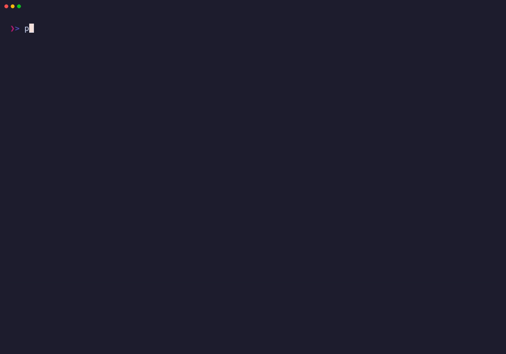

# pcx

[Documentation](https://takeshid.github.io/pcx/) · [日本語](./README.ja.md)

`pcx` is a shell-native toolbox for inspecting and reducing point-cloud recordings on edge Linux systems.

> **Project status:** active development. The executable provides MCAP inspection, one-frame PCD extraction, faithful one-message MCAP passthrough, and terminal rendering of MCAP Point Frames and PCD Static Clouds.

## Why pcx?

Large sensor recordings often live on robots and industrial PCs where a desktop viewer is unavailable and copying the whole file is wasteful. `pcx` is designed around one workflow:

```text
inspect -> reduce -> transfer with existing shell tools
```

The product aims to remain a single executable with bounded memory, binary-safe stdout, actionable stderr diagnostics, and no ROS runtime, GUI, daemon, AWS, or S3 client.

## Availability

| Capability                                         | Status                |
| ---                                                | ---                   |
| `pcx --help`, `pcx --version`                      | Available             |
| `pcx info` MCAP metadata                           | Available             |
| MCAP Topic listing with human and JSON output      | Available             |
| ROS 2 `PointCloud2` frame extraction               | Available             |
| Binary and ASCII PCD output                        | Available             |
| Strict PCD reader and Static Cloud rendering       | Available             |
| Encoded one-message MCAP passthrough               | Available             |
| Bounded synchronous LAS/LAZ library I/O            | Available             |
| Crop, field selection, frame-local voxel reduction | Planned               |
| PLY scalar-vertex adapter (CLI integration later)  | Available internally  |
| `pcx render` CPU projection and terminal output    | Available             |
| LAS/LAZ CLI commands                                | Planned               |
| AWS/S3 upload and cloud credentials                | Out of scope          |
| macOS and Windows support                          | Undecided future work |

## Install

Install the published command from crates.io:

```bash
cargo install pcx-cli --locked
pcx --version
```

To build the current checkout instead:

```bash
git clone https://github.com/takeshiD/pcx.git
cd pcx
cargo install --path . --locked
pcx --version
```

With Nix:

```bash
nix run github:takeshiD/pcx -- --version
nix develop github:takeshiD/pcx
```

The Nix package and Linux release archives include Bash, Zsh, and Fish
completions plus manual pages. See the
[installation guide](https://takeshid.github.io/pcx/installation/) for their
locations and regeneration workflow.

## Quick start

The repository includes a small, valid ROS 2 `PointCloud2` MCAP fixture, so the
complete inspect-to-extract path can be tried without finding sample data first:

```bash
git clone https://github.com/takeshiD/pcx.git
cd pcx

pcx topics tests/fixtures/valid/pointcloud2.mcap
pcx render tests/fixtures/valid/pointcloud2.mcap \
  --topic /lidar/points --frame 0 --width 32 --height 12
pcx extract tests/fixtures/valid/pointcloud2.mcap \
  --topic /lidar/points --frame 0 --encoding ascii -o /tmp/frame.pcd
pcx render tests/fixtures/valid/pointcloud2-ascii.pcd \
  --width 32 --height 12
```

The first command identifies the Topic and confirms that its declaration is a
ROS 2 `PointCloud2` candidate. `render` previews the selected frame inline;
`extract` writes the same frame as a PCD investigation artifact. Use `--at 0ns`
instead of `--frame 0` to select by recording-relative log time.
The final command reads a PCD Static Cloud directly; static Sources do not use
Topic or Point Frame selectors.



The recording is generated from [`demo/quickstart.tape`](./demo/quickstart.tape);
see [`demo/README.md`](./demo/README.md) for the reproducible build command.

## Command examples

The five current subcommands cover MCAP inspection, Point Frame selection,
terminal preview, PCD extraction, and faithful encoded passthrough:

```bash
pcx info run.mcap
pcx topics run.mcap --json
pcx extract run.mcap \
  --topic /lidar/points \
  --frame 0 \
  -o frame.pcd
pcx passthrough run.mcap \
  --topic /lidar/points \
  --frame 0 \
  --compression zstd \
  -o selected.mcap
pcx render run.mcap \
  --topic /lidar/points \
  --frame 0
pcx render cloud.pcd
```

Choose exactly one of `--frame INDEX` and `--at DURATION`. Binary PCD is the
default; pass `--encoding ascii` for text PCD. `--memory-limit BYTES` is a hard
managed-memory budget. Output must be an explicit path or `-` for stdout.

`pcx passthrough` applies the same selector without decoding point fields. It
preserves the selected encoded Message and its Channel/Schema relationship,
plus recording-level attachments, metadata, and application-private records.
Derived container structure, statistics, and CRCs are regenerated
deterministically; attachment and metadata indexes are omitted to bound memory.

`pcx render` decodes and projects exactly one selected MCAP Point Frame or one
PCD Static Cloud, then writes one inline image to stdout. MCAP requires
`--topic` and exactly one selector; PCD accepts neither. `--backend auto` is the
default: redirected stdout uses deterministic control-free Unicode text, while an interactive terminal
falls back conservatively to Unicode; the current process query does not
auto-authorize a graphics protocol. Use `--backend unicode`, `kitty`, or
`sixel` to make an interactive
choice explicit. Explicit graphics and ANSI-capable backends are rejected when
stdout is redirected, before an escape sequence is written. `NO_COLOR`
disables ANSI color in Unicode output.

Run `pcx <COMMAND> --help` for every option, or use the
[command guide](https://takeshid.github.io/pcx/commands/) for stream behavior,
limits, backend selection, and exit-status details.

Transfer remains the shell's job:

```bash
ssh robot 'pcx extract /data/run.mcap --topic /lidar/points --frame 0 -o -' \
  > frame.pcd
```

## Architecture

The implementation is one publishable Rust package with deep internal modules. Encoded container records remain separate from decoded point frames:

```text
CLI -> JobSpec -> Planner -> Executor
                              |
                 +------------+-------------+
                 |                          |
        container passthrough        semantic pipeline
                                            |
                            CDR -> PointView/PointBatch
                                            |
                                    operator -> encoder
```

See the [architecture document](./docs/ARCHITECTURE.md), [test strategy](./docs/TESTING.md), [implementation roadmap](./docs/ROADMAP.md), [domain language](./CONTEXT.md), and [decision records](./docs/adr/).

## Development

```bash
cargo fmt --all -- --check
cargo clippy --all-targets --all-features -- -D warnings
cargo check --all-targets --all-features
cargo test --all-features
nix flake check
```

The Starlight documentation lives in `docs/pages`:

```bash
npm --prefix docs/pages ci
npm --prefix docs/pages run check
npm --prefix docs/pages run build
```

## Supported systems

- `x86_64-linux`: native build and full test suite
- `aarch64-linux`: native build and full test suite
- macOS and Windows: not currently supported; future support is undecided

## Contributing

Start with [CONTRIBUTING.md](./CONTRIBUTING.md). Security-sensitive reports should follow [SECURITY.md](./SECURITY.md).

## License

MIT © 2026 tkcd. See [LICENSE](./LICENSE).
